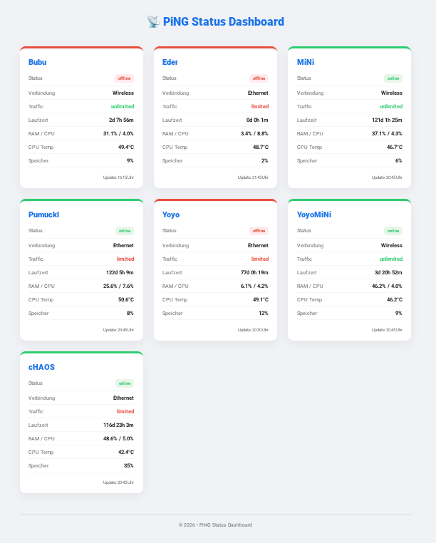

# PiNG Status Dashboard

A lightweight, self-hosted dashboard to monitor the status, temperature, and load of your Raspberry Pi cluster, HomeLab devices, or any Linux server.

It consists of a simple PHP backend and a bash script (`client.sh`) that runs on your devices via cronjob. No heavy database required – it uses simple JSON files!

> **Vibe Coding:** This project was built entirely using "Vibe Coding" with Google Gemini.

> ** Note on Raspberry Pi:** The `client.sh` script is specifically optimized for Raspberry Pi OS. It uses the `vcgencmd` command to read the CPU temperature. It works on other Linux machines too, but the temperature reading will be blank unless you modify the `TEMP=` variable in the script (e.g., using `cat /sys/class/thermal/thermal_zone0/temp`).

## Features
* **No Database:** Uses flat JSON files for maximum simplicity and speed.
* **Lightweight Agent:** Only requires `curl` and standard Linux tools (top, free, df).
* **Alerting:** Sends an email notification if a device goes offline (and another when it recovers).
* **Responsive Dashboard:** Clean UI to check your device stats at a glance.
* * **Zero Setup:** The required `data/` directory is created automatically on the server as soon as the first device sends its ping.

## Installation (Server / Dashboard)

1. Upload the `.php` files to your web server (e.g., Apache, Nginx).
2. Open `config.php` and set your own secure `PING_TOKEN` and your email addresses for alerts.
   * Set a secure `PING_TOKEN`.
   * Set the `ADMIN_EMAIL` (the address that will receive the offline alerts).
   * Set the `SENDER_EMAIL` (the "From" address. To avoid spam filters, this should ideally be an address from the domain where this dashboard is hosted).
5. Set up a cronjob on your web server to run `check.php` every 5-10 minutes to enable email alerts for offline devices:

   */5 * * * * /usr/bin/php /path/to/your/webspace/check.php >/dev/null 2>&1

## Installation (Client / Agent)

On every device you want to monitor (e.g., your Raspberry Pi):

1. Download the `client.sh` script to your device.
2. Open `client.sh` and edit the Configuration section at the top:
   * Set your `DEVICE` name.
   * Enter the exact same `TOKEN` you defined in your `config.php`.
   * Update the `URL` to point to your `heartbeat.php`.
3. Make the script executable:

   chmod +x client.sh

4. Create a cronjob to run the script automatically (e.g., every minute). Open your crontab:

   crontab -e

   Add this line at the bottom:

   * * * * * /path/to/your/client.sh >/dev/null 2>&1

## Requirements
* **Server:** Any web server with PHP 7.4 or newer.
* **Client:** A Linux-based OS (Debian, Ubuntu, Raspberry Pi OS) with `curl`.
